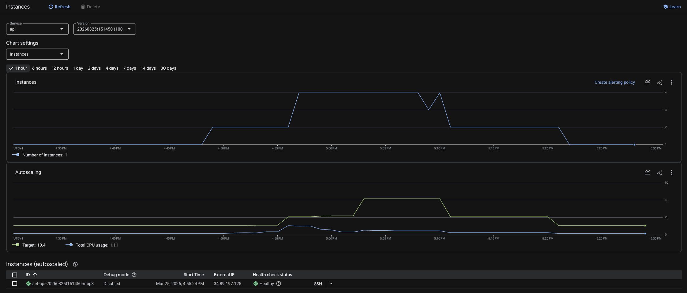

# Terheléspróba és automatikus skálázás – Google App Engine Flex környezetben

## 1. Bevezetés

Jelen dokumentum a PikVjú fotóalbum alkalmazás terheléspróbájának jegyzőkönyvét és az alkalmazott automatikus skálázás konfigurációjának leírását tartalmazza.

A terheléspróba célja kettős volt: egyrészt az alkalmazás viselkedésének vizsgálata növekvő felhasználói terhelés mellett, másrészt az App Engine automatikus skálázási mechanizmusának demonstrálása és dokumentálása.

### 1.1 Technológiai áttekintés

| Komponens | Technológia |
|---|---|
| Backend API | .NET 8 Web API (custom Docker) |
| Adatbázis | PostgreSQL 15 — Google Cloud SQL |
| Hosting | Google App Engine Flexible Environment |
| Frontend | Angular 18+ SPA (App Engine Standard) |
| Terhelésteszt | Locust 2.x (Python) |

---

## 2. Automatikus skálázás konfigurációja

A backend szolgáltatás automatikus skálázási beállításait az App Engine konfigurációs fájlja (`app.yaml`) tartalmazza. A Flexible Environment VM-alapú Docker konténereket futtat, ezért egy új instance elindítása tipikusan 60–120 másodpercet vesz igénybe.

### 2.1 app.yaml konfiguráció

```yaml
runtime: custom
env: flex
service: api

resources:
  cpu: 1
  memory_gb: 1
  disk_size_gb: 10

automatic_scaling:
  min_num_instances: 1
  max_num_instances: 4
  cool_down_period_sec: 60
  cpu_utilization:
    target_utilization: 0.6
  target_concurrent_requests: 10
```

### 2.2 Paramétermagyarázat

| Paraméter | Érték | Indoklás |
|---|---|---|
| `min_num_instances` | 1 | Alap állapotban egy instance elegendő |
| `max_num_instances` | 4 | 50 csúcsfelhasználóhoz 4–5 instance szükséges |
| `cool_down_period_sec` | 60 (minimum érték) | Skálázási döntések közötti minimális várakozási idő |
| `target_utilization` (CPU) | 0.6 | Átlagos CPU 60% felett vált ki újabb instance-t |
| `target_concurrent_requests` | 10 | Instance-onként 10 párhuzamos kérés felett skálázódik |


*1. ábra: Instance count (felső) és autoscaling metrikák (alsó) — jól látható az 1→4 scale-out a csúcsterhelés alatt, majd a visszaskálázás*

---

## 3. Terheléspróba konfigurációja

### 3.1 Eszköz: Locust

A terheléspróbát a Locust nyílt forráskódú Python-alapú keretrendszerrel végeztem, amelyet egy GCP Compute Engine VM-ről futtattam, így kiküszöbölve a helyi hálózati késleltetést.

A teszt konfigurációja és forráskódja megtekinthető a [`load-tests/locustfile.py`](../load-tests/locustfile.py) fájlban.

### 3.2 Felhasználói modellek

| Osztály | Arány | Leírt viselkedés |
|---|---|---|
| `RegisteringUser` | ~25% | Névtelen látogató: publikus albumok böngészése, regisztráció, sikertelen bejelentkezési kísérlet |
| `PhotoAlbumUser` | ~75% | Hitelesített felhasználó: teljes album- és képkezelés, token-megújítás, megosztás |

### 3.3 Terhelési profil (ScalingDemoShape)

A teszt egy ötfázisú terhelési profilt követett, amely összesen ~15 percig tartott. A fokozatos rámpa lehetővé teszi mind a scale-out, mind a scale-in demonstrálását.

| Fázis | Időtartam | Virtuális felhasználók | Várt GCP viselkedés |
|---|---|---|---|
| 1 — Warm-up | 0–2 perc | 10 | 1 instance |
| 2 — Ramp-up | 2–5 perc | 30 | 2–3. instance elindul |
| 3 — Csúcs | 5–9 perc | 50 | 4. instance elindul |
| 4 — Csökkentés | 9–12 perc | 15 | Scale-in megkezdődik |
| 5 — Cool-down | 12–15 perc | 5 | Visszaáll 1 instance-ra |

### 3.4 Tesztelt végpontok

#### Autentikáció (`/api/user`)

| Végpont | Metódus | Leírás | Felhasználó típusa |
|---|---|---|---|
| `/api/user/register` | POST | Új fiók regisztrálása | RegisteringUser |
| `/api/user/login` | POST | Bejelentkezés (sikeres és 401-es eset) | Mindkettő |
| `/api/user/logout` | POST | Kijelentkezés | PhotoAlbumUser |
| `/api/user/refresh-token` | POST | JWT token megújítása | PhotoAlbumUser |
| `/api/user/me` | GET | Saját profil lekérése | PhotoAlbumUser |
| `/api/user/me` | PUT | Saját profil módosítása | PhotoAlbumUser |
| `/api/user/search` | GET | Felhasználók keresése (`?q=`) | PhotoAlbumUser |
| `/api/user/public/{id}` | GET | Más felhasználó publikus profilja | PhotoAlbumUser |

#### Albumok (`/api/album`)

| Végpont | Metódus | Leírás | Felhasználó típusa |
|---|---|---|---|
| `/api/album/public` | GET | Publikus albumok listázása | Mindkettő |
| `/api/album/search` | GET | Albumok keresése (`?q=`) | Mindkettő |
| `/api/album/my` | GET | Saját albumok listázása | PhotoAlbumUser |
| `/api/album/shared` | GET | Megosztott albumok listázása | PhotoAlbumUser |
| `/api/album/{id}` | GET | Album részleteinek lekérése | Mindkettő |
| `/api/album/{id}` | PUT | Album módosítása | PhotoAlbumUser |
| `/api/album/{id}` | DELETE | Album törlése | PhotoAlbumUser |
| `/api/album` | POST | Új album létrehozása | PhotoAlbumUser |
| `/api/album/{id}/cover` | GET | Album borítóképének lekérése | Mindkettő |
| `/api/album/{id}/cover` | PUT | Album borítóképének beállítása | PhotoAlbumUser |
| `/api/album/{id}/shares` | GET | Album megosztások listázása | PhotoAlbumUser |
| `/api/album/{id}/share` | POST | Album megosztása felhasználóval | PhotoAlbumUser |
| `/api/album/{id}/share/{uid}` | DELETE | Megosztás visszavonása | PhotoAlbumUser |
| `/api/album/{id}/download` | GET | Album letöltése ZIP-ben | PhotoAlbumUser |

#### Képek (`/api/picture`)

| Végpont | Metódus | Leírás | Felhasználó típusa |
|---|---|---|---|
| `/api/picture/album/{id}` | GET | Album képeinek listázása | PhotoAlbumUser |
| `/api/picture/album/{id}/thumbnails` | GET | Album bélyegképeinek listázása | PhotoAlbumUser |
| `/api/picture/album/{id}` | POST | Kép feltöltése albumba | PhotoAlbumUser |
| `/api/picture/{id}` | GET | Kép metaadatainak lekérése | PhotoAlbumUser |
| `/api/picture/{id}/thumbnail` | GET | Bélyegkép lekérése | PhotoAlbumUser |
| `/api/picture/{id}/data` | GET | Teljes felbontású kép lekérése | PhotoAlbumUser |
| `/api/picture/{id}/name` | PATCH | Kép átnevezése | PhotoAlbumUser |
| `/api/picture/{id}` | DELETE | Kép törlése | PhotoAlbumUser |

---

## 4. Terheléspróba eredményei

A teszt 15 perc alatt, legfeljebb 50 párhuzamos virtuális felhasználóval összesen 12 505 kérést generált, amelyből 2 996 hibával végződött. Az összesített hibaarány 23,9%, az átlagos válaszidő 115 ms, a medián 47 ms, az áteresztőképesség 13,9 kérés/s.

> **Megjegyzés:** A 2 996 hibából 170 szándékos, kontrollált hiba: a `RegisteringUser` típus egy dedikált feladatban (`login_with_wrong_password`) szándékosan érvénytelen hitelesítő adatokkal próbál bejelentkezni, kizárólag a 401-es elutasítási útvonal terhelés alatti viselkedésének tesztelésére. Ezek a hibák nem rendszerproblémát jeleznek. A valósan problémás hibák száma tehát **2 826**.

### 4.1 Az App Engine hidegindulás mint elsődleges hibaok

Az eredményeket az App Engine Flex környezetének hidegindulási (cold start) késleltetése befolyásolta leginkább. Amikor a terhelés növekedése új instance indítását igényli (2. és 3. fázisban), az első kérések a még fel nem állt instance-okra érkeznek, és vagy hosszú várakozás (~1–8 s) után teljesülnek, vagy timeout miatt meghiúsulnak.

A hidegindulás önmagában is komoly problémákat vet fel, hiszen 1–2 perc hatalmas kiesés a „plusz" felhasználók számára, de következményei a teszt eredményét is nagyban befolyásolják.

### 4.2 A kaszkád hatás: egy sikertelen bejelentkezés mennyi kérést visz magával

A `PhotoAlbumUser` sessionje úgy épül fel, hogy minden authenticated végpont hívása feltételezi az érvényes JWT tokent. Ha a token megszerzése vagy megújítása meghiúsul, az adott session teljes authenticated forgalma elhal.

A két érintett belépési pont:

| Végpont | Kérések | Hibák | Hibaarány |
|---|---|---|---|
| `POST /api/user/refresh-token` | 371 | 277 | 74,7% |
| `POST /api/user/login` | 539 | 210 | 39,0% |

A `refresh-token` végpont közel háromnegyede meghiúsul. A kód ilyenkor visszaesik a teljes login folyamatra — ez magyarázza, miért ilyen magas (39%) a login hibaaránya is: a normál bejelentkezési kérések mellé a visszaeső refresh-kísérletek is rázúdulnak a végpontra, tovább növelve annak terhelését.

A közvetlen autentikációs hibák száma (szándékos 401-ek és logout nélkül): 277 (refresh) + 210 (login) = **487 hiba**

Ezek a hibák nem zárt eseményekként végződnek. Egy `PhotoAlbumUser` virtuális felhasználó sessionjén belül a sikertelen auth után az összes következő feladat — album létrehozás, képfeltöltés, listázások, megosztás — mind elhal. Az authenticated resource végpontokon mért összes hiba:

| Kategória | Összes kérés | Hibák |
|---|---|---|
| Album CRUD + listázás | ~3 400 | ~872 |
| Kép CRUD + listázás | ~3 519 | ~799 |
| **Összesen** | **~6 919** | **~1 671** |

Ez azt jelenti, hogy a 2 826 valódi hibából ~487 közvetlen auth hiba keletkezett, és ezek ~1 671 downstream resource hibát húztak maguk után — azaz minden egyes autentikációs hiba átlagosan ~3,4 további hibát okozott a pipeline többi elemén. Az összes valódi hiba közel 76%-a (2 158/2 826) visszavezethető a hideg indításból adódó bejelentkezés hiányára.

---

## 5. Összefoglalás

A terheléspróba meggyőzően igazolta, hogy az alkalmazás automatikus skálázási mechanizmusa helyesen működik: a GCP App Engine Flex környezetben az új instance-ok a forgalom növekedésével arányosan indultak el, majd a terhelés csökkenése után a rendszer visszaállt az alap konfigurációra. A skálázódás tehát funkcionálisan kifogástalan volt.

Ugyanakkor a felhőben való terheléstesztelés rendkívül értékes tapasztalatot nyújtott számomra. A magas hibaarány döntő részben nem hibás konfigurációra, hanem a Flex környezet természetes sajátosságára, az instance-indítás viszonylag lassú reakcióidejére vezethető vissza. Ezt jól illusztrálja, hogy kódmódosítás nélkül, pusztán a skálázási beállítások finomhangolásával az első futtatáshoz képest közel felére sikerült csökkenteni a hibaarányt. Ez rávilágít arra, hogy a beállítások alapos megértése és iteratív hangolása legalább annyira meghatározó, mint maga az alkalmazáskód minősége.

A tesztelés komplexitása kapcsán szintén fontos tanulság fogalmazódott meg bennem: egy terhelési teszt számszerűen szembesít azzal, hogy amit egyetlen felhasználó „elviselhető" lassúságként él meg, az párhuzamos forgalom esetén megsokszorozódva komoly rendszerszintű problémává válhat. Ez a szemlélet éles környezetben különösen felértékelődik.

A tapasztalatok alapján éles termelési üzemben érdemes legalább `min_num_instances: 2` értéket beállítani, hogy a cold start okozta kezdeti hibák elkerülhetők legyenek. Hosszabb távon megfontolásra érdemes a Cloud Run alkalmazása, ahol az instance-indítási idő másodpercekben mérhető, szemben a Flex környezet jellemzően fél-egy perces felfutási idejével.
